<h1 align="center">Hi 👋, I'm Rawnak</h1>

  

<h3 align="center">A passionate frontend developer from Dhaka, Bangladesh. I love building real-world applications, especially in healthcare and mobile app development. I enjoy solving problems and learning new technologies.</h3>

- 🔭 I’m currently working on **Emergency Medical Service System**

- 🌱 I’m currently learning **Next.js, Firebase, Advanced Android Development, System Design**

- 👨‍💻 All of my projects are available at [https://github.com/rawnakwow](https://github.com/rawnakwow)

- 💬 Ask me about **Java, Android Development, React, Firebase, Web Development**

- 📫 How to reach me **mail.rawnakr955@gmail.com**

- ⚡ Fun fact **I love building useful applications from simple ideas**

## 🌐 Connect With Me

## 🛠️ Technologies & Tools

### 🔗 Frontend Development

  

### 🔗 Backend Development

  

### 🔗 Databases

  

### 🔗 Programming Languages

  

### 🔗 AI & Machine Learning

  

### 🔗 Hardware & Embedded Systems

  

### 🔗 Design & Graphics

  

### 🔗 Tools & Technologies

  

---

## 📊 GITHUB STATISTICS & ANALYSIS

### 📈 GitHub Stats

  

  

### 🔥 GitHub Streak

  

### 🐍 GitHub Contribution Snake

  <picture>
    <source
      media="(prefers-color-scheme: dark)"
      srcset="https://raw.githubusercontent.com/rawnakwow/rawnakwow/output/github-contribution-grid-snake-dark.svg"
    />

    <source
      media="(prefers-color-scheme: light)"
      srcset="https://raw.githubusercontent.com/rawnakwow/rawnakwow/output/github-contribution-grid-snake.svg"
    />

    
  </picture>

### 📌 Contribution Activity

  

### 📋 Profile Summary

  

<h3 align="left">Social</h3>

  
  

